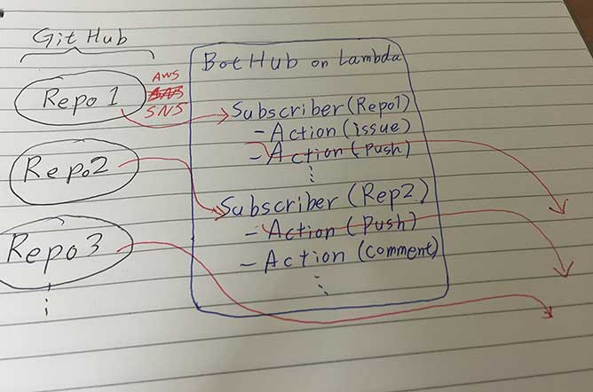

# BotHub

Github の WebHook を受け取って何かする奴を簡単に書くためのミドルウェア。

**どのリポジトリ** の **何のイベント** かに注目して動作を記述することができる。

```
BotHub
  |- Subscriber for repo1
  |      |- action for issue comment event
  |      |- action for push event
  |      |- ...
  |- Subscriber for repo2
  |      |- action for pullrequest review comment event
  |      |- action for push event
  |      |- ...
  |- ...
```



## 使い所

- 複数のリポジトリを持っている
- それらのリポジトリで似たような Bot Operation をしたい
- Bot Operation のトリガは Web Hook でよい
- 実行環境は AWS Lambda とか Heroku でよい

## こだわり

取り扱うリポジトリが増えた時に以下のようなリポジトリ名やイベントを比較するコードを散りばめたくない。

```js

if (reponame === "hoge/repo1"
   || reponame === "hoge/repo2"
   || reponame === "hoge/repo3" /* ....*/) {

     if (event == "push") {
        // 😵😵 do some thing...
     }
   }
```

BotHub では Web Hook を受け取る人 (Subscriber) を登録するようなイメージで動作を追加するためリポジトリ名を比較する処理は必要ない。

また、よく使う処理をモジュール化できるためリポジトリが増えた時に対応しやすい。

## example

```js

// index.js

const BotHub = require("bothub")

let bothub = new BotHub()

bothub.subscribe("repo/name").issues((body, callback) => {
    // some thing...
    callback(null)
    // when error occurred
    // callback(error)
})

bothub.subscribe("repo/name").issues((body, callback) => {
    // some thing else...
    callback(null)
})

bothub.subscribe("repo/name").issue_comment((body, callback) => {
    // some thing...
    callback(null)
})

bothub.subscribe("other/repo").push((body, callback) => {
    // some thing...
    callback(null)
})
```

### modular

```js
// basic_subscriber.js

const Subscriber = require("bothub").Subscriber

let subscriber = new Subscribe()

subscriber.issues((body, callback) => {
    // some thins...
    callback(null)
})

subscriber.issue_comment((body, callback) => {
    // some thins...
    callback(null)
})

module.exports = subscriber

```

```js
// index.js

const BotHub = require("bothub")

const basicSubscriber = require("./basic_subscriber")

let bothub = new BotHub()

bothub.use("repo/name", basicSubscriber)
bothub.subscribe("repo/name").issues((body, callback) => {
    // some thins...
    callback(null)
})

bothub.use("other/repo", basicSubscriber)

```
